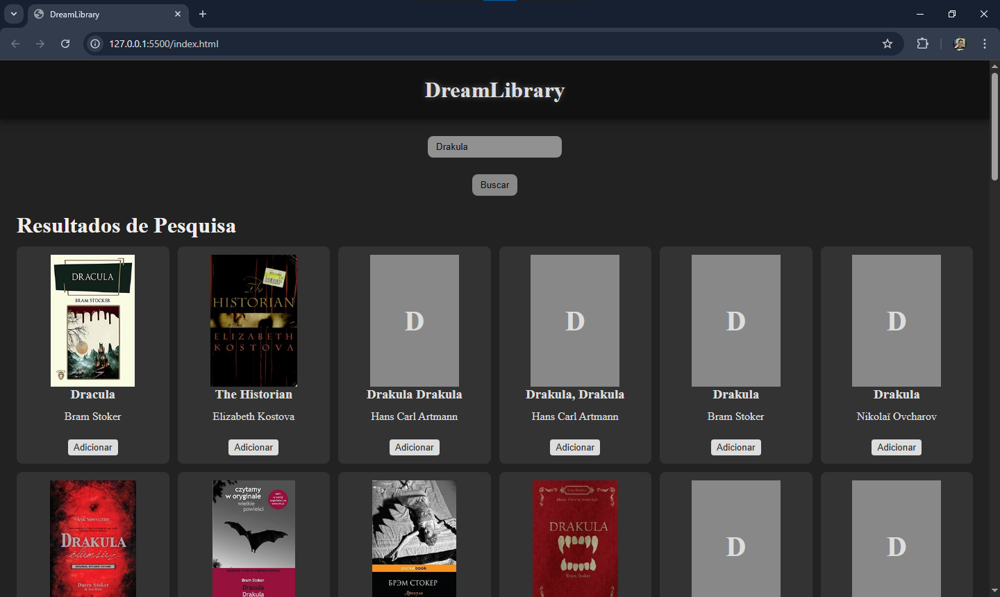

# 📚 Biblioteca de Livos

Aplicação web simples que permite buscar livros através da API da Open Library e salvar em uma biblioteca pessoal com persistência local.

---

---

## 🚀 Funcionalidades

- 🔎 Buscar livros por título
- ➕ Adicionar livro à biblioteca
- ❌ Remover livro da biblioteca
- 💾 Persistência com LocalStorage
- 🖼️ Exibição de capa do livro (com fallback)
- 🚫 Prevenção de duplicação de livros

---

## 🛠️ Tecnologias Utilizadas

- HTML5
- CSS3
- JavaScript (Vanilla JS)
- API pública da Open Library

---

## 🌐 API Utilizada

Open Library Search API:

https://openlibrary.org/search.json?q=termo

---

## 🧠 Conceitos Aplicados

- Manipulação de DOM
- Event Delegation
- Gerenciamento de estado (State pattern simples)
- Consumo de API com Fetch
- Persistência com LocalStorage
- Separação de responsabilidades
- Renderização dinâmica
- Tratamento de erros visuais (fallback de imagem)

---

## 📂 Estrutura do Projeto

    📦 biblioteca
    ┣ 📜 index.html
    ┣ 📜 style.css
    ┣ 📜 main.js
    ┗ 📜 README.md

---

## 🎯 Objetivo do Projeto

Praticar conceitos fundamentais de JavaScript puro simulando uma aplicação real com:

- Estado global
- Renderização dinâmica
- CRUD básico
- Integração com API externa

---

## 🔮 Melhorias Futuras

- Paginação de resultados
- Sistema de filtros
- Ordenação por título/autor
- Interface mais elaborada
- Modularização do código
- Deploy online

---

## 👨‍💻 Autor

Desenvolvido por Ernand Soares (Mizum) como parte do processo de aprendizado em JavaScript.
